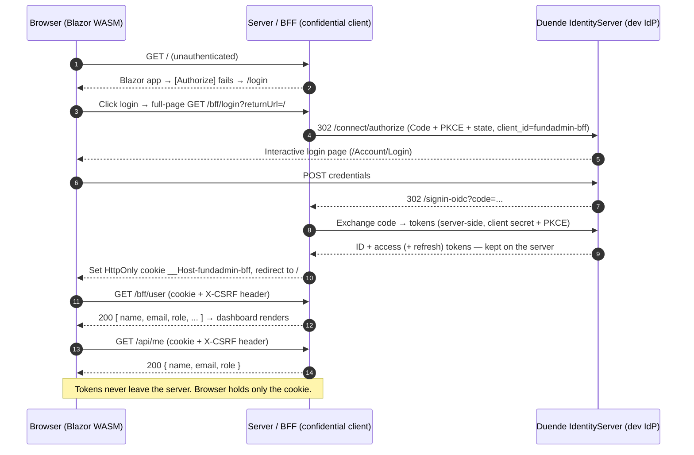

# FundAdmin Asset Management — Blazor WebAssembly (.NET 8) + BFF SSO

An asset-management system for mutual funds, built as a **hosted Blazor WebAssembly**
application that authenticates through **OIDC Single Sign-On** using the
**Backend-for-Frontend (BFF)** security pattern.

> **Why BFF?** In a plain SPA the access/ID tokens live in the browser (readable by
> JavaScript, exposed in the Network tab, vulnerable to XSS token theft). With BFF
> the **server** performs the OIDC code exchange and **keeps the tokens server-side**.
> The browser only ever holds an **HttpOnly, Secure session cookie** — no token is
> ever exposed to JavaScript or visible in the browser.

The solution is **self-contained**: it ships with an in-memory **Duende IdentityServer**
dev Identity Provider, so you can run and test the full login → dashboard → logout
flow with a single command — **no external SSO provider required**.

---

## Prerequisites

- **.NET 8 SDK** (the projects target `net8.0`; a newer SDK such as .NET 9/10 also
  builds them as long as the .NET 8 runtime/targeting pack is available).
- A trusted local HTTPS development certificate:

  ```bash
  dotnet dev-certs https --trust
  ```

## Run

```bash
dotnet run --project Server
```

Then open: **https://localhost:5001**

> In Visual Studio: make sure **`Server`** is the startup project (right-click
> `Server` → **Set as Startup Project**), then press **F5**. The `Client` and
> `Shared` projects are class libraries and cannot be started directly.

### Test user

| Username                     | Password    | Role               |
| ---------------------------- | ----------- | ------------------ |
| `analyst@fundadmin.local`    | `Passw0rd!` | InvestmentManager  |

> The login form is pre-filled with these credentials for convenience.

---

## What you should see (end-to-end flow)

1. Open `https://localhost:5001` → not authenticated → redirected to the **Login** page.
2. Click **"Login dengan SSO"** → a full-page redirect to `/bff/login` → the dev IdP login page.
3. Sign in with the test user → redirected back to the app.
4. Land on the **Dashboard** showing the signed-in user's **name and role**
   (`Andi Analyst` / `InvestmentManager`) plus dummy widget cards.
5. The dashboard calls **`GET /api/me`** using the session cookie and shows
   `{ name, email, role }`.
6. The sidebar shows placeholder pages: **Stock Position**, **Shares**,
   **Chart of Account** ("Coming soon").
7. Click **Logout** → cookie + IdP session cleared → back to the Login page.

> **Verify the security win:** open DevTools → **Network** / **Application**. You will
> only find the `__Host-fundadmin-bff` cookie (HttpOnly) — **no access token anywhere**.

---

## Authentication flow (sequence)



---

## Architecture

```
Project-SSO/
├─ FundAdmin.slnx              # solution
├─ Client/                     # Blazor WebAssembly (runs in the browser)
│  ├─ Program.cs               # HttpClient + AntiforgeryHandler, BFF auth state
│  ├─ App.razor                # Router + AuthorizeRouteView + Cascading auth state
│  ├─ Services/
│  │  ├─ BffAuthenticationStateProvider.cs  # reads /bff/user (no tokens client-side)
│  │  └─ AntiforgeryHandler.cs              # adds the X-CSRF header to every call
│  ├─ Pages/                   # Dashboard, Login, placeholders, AccessDenied
│  ├─ Layout/                  # MainLayout, NavMenu, EmptyLayout (chromeless login)
│  ├─ Components/              # RedirectToLogin
│  └─ wwwroot/css/app.css      # design tokens + component styles (theme)
├─ Server/                     # ASP.NET Core: host + BFF + API + dev Identity Provider
│  ├─ Program.cs               # Cookie + OpenIdConnect + Duende.BFF + IdentityServer
│  ├─ Config.cs                # In-memory clients / scopes / resources / test users
│  ├─ Controllers/MeController.cs   # GET /api/me  ([Authorize] cookie, BFF endpoint)
│  ├─ Pages/Account/Login.*    # Interactive IdP login page
│  └─ Pages/Account/Logout.*   # IdP end-session (RP-initiated logout) handler
└─ Shared/                     # Shared DTOs
   └─ UserProfileDto.cs        # { Name, Email, Role }
```

### Roles each project plays

The **Server** runs four roles on one origin (`https://localhost:5001`):

1. **Host** for the compiled Blazor WASM client (`UseBlazorFrameworkFiles`).
2. **BFF / confidential OIDC client** — does the Authorization Code + PKCE exchange
   server-side (`AddOpenIdConnect`), stores tokens server-side, and exposes the
   secure `/bff/*` endpoints (`Duende.BFF`).
3. **Local API** (`/api/me`) protected by the cookie + BFF antiforgery.
4. **Dev Identity Provider** (Duende IdentityServer) issuing the tokens.

### Authentication schemes

| Scheme   | Purpose                                                           |
| -------- | ---------------------------------------------------------------- |
| `cookie` | The **BFF session** cookie (`__Host-fundadmin-bff`, HttpOnly, Secure, SameSite=Strict). Application **default** scheme. |
| `oidc`   | Challenges the IdP to sign the user in (server-side code+PKCE).   |
| `idsrv`  | IdentityServer's **own** login session for its interactive UI. Pinned via `options.Authentication.CookieAuthenticationScheme` so it is not confused with the BFF cookie. |

### CSRF protection

Because authentication rides on a cookie, the BFF requires a static **`X-CSRF: 1`**
header on `/bff/user` and `/api/*`. The client adds it through `AntiforgeryHandler`;
the server enforces it via `.AsBffApiEndpoint()` and the `/bff` management endpoints.

### OIDC configuration (`Oidc` section in `Server/appsettings.json`)

| Setting        | Value                                                       |
| -------------- | ---------------------------------------------------------- |
| Authority      | `https://localhost:5001`                                   |
| ClientId       | `fundadmin-bff`                                            |
| ClientSecret   | `fundadmin-bff-dev-secret` (dev only — move to a secret store) |
| Grant / PKCE   | Authorization Code + PKCE (S256)                           |
| Scopes         | `openid`, `profile`, `email`, `fundadmin.api`, `offline_access` |
| RedirectUri    | `https://localhost:5001/signin-oidc`                       |
| PostLogoutUri  | `https://localhost:5001/signout-callback-oidc`            |

> The **Client** (`Client/wwwroot/appsettings.json`) holds **no** OIDC settings —
> in the BFF model the browser never speaks OIDC.

---

## User interface

A small, consistent design system lives in `Client/wwwroot/css/app.css` (CSS
custom-property tokens) plus the scoped `*.razor.css` files:

- **Theme** — solid navy brand (`#1e3a8a` / dark `#0f172a`), light slate
  background, rounded cards, soft shadows. Professional fintech look.
- **Login** — full-screen, chromeless page (`EmptyLayout`) with a centered card,
  brand mark, the dev credentials, and an `+ MFA (TOTP)` hint.
- **Shell** — sticky white top bar with the app title and a **user chip**
  (initials avatar + name + role) and Logout; a dark navy **sidebar** with
  grouped sections (Report, Master Data) and an active-item accent bar.
- **Dashboard** — a solid navy welcome hero (name + role pill), three **stat cards**
  with colored icon badges, and a dark `/api/me` verification panel.
- **Placeholders / Access denied** — shared `.empty-state` and `.page-head`
  styles for a consistent "coming soon" / message look.

Icons come from **Bootstrap Icons** (CDN); the grid/utilities from **Bootstrap**.

## Screenshots

> Drop your captured images into a `docs/` folder and they will render here.

| Screen | Preview |
| ------ | ------- |
| Login page (SSO button) | `docs/01-login.png` |
| Dev IdP sign-in | `docs/02-idp-login.png` |
| Dashboard (welcome + widgets + `/api/me`) | `docs/03-dashboard.png` |
| Network tab — only a cookie, no token | `docs/04-network-no-token.png` |

---

## Switching to a production Identity Provider (Azure AD / Keycloak)

Swapping providers requires **configuration changes only** — no application code:

1. In `Server/appsettings.json`, update the `Oidc` section (`Authority`, `ClientId`,
   `ClientSecret`, scopes).
2. In `Server/Program.cs`, delete the `AddIdentityServer(...)` block and the
   `app.UseIdentityServer()` call, and remove the `Server/Pages/Account/*` pages
   (those exist only for the in-memory dev IdP).
3. Register these redirect URIs in your real provider:
   `https://localhost:5001/signin-oidc` and `https://localhost:5001/signout-callback-oidc`.

Search for the `TODO:` comments in `Server/Program.cs` and `Server/Config.cs`.

---

## Troubleshooting

**"A project with an Output Type of Class Library cannot be started directly."**
You are trying to run `Client` or `Shared`. Only **`Server`** is executable — set it
as the startup project, or run `dotnet run --project Server`.

**Login keeps returning to the sign-in page ("User is not authenticated" loop).**
IdentityServer must read its session from its own `idsrv` scheme, not the BFF
default `cookie` scheme. This is pinned in `Server/Program.cs` with
`options.Authentication.CookieAuthenticationScheme = IdentityServerConstants.DefaultCookieAuthenticationScheme;`.

**Login succeeds but the dashboard never appears (stays anonymous).**
The client reads `/bff/user`, whose claim values are **not all strings**
(`bff:session_expires_in` is a number). The auth-state provider deserializes each
value as a `JsonElement` and stringifies it — deserializing straight into `string`
throws and silently logs the user out.

**Browser shows a certificate warning on `https://localhost:5001`.**
Trust the local dev cert once: `dotnet dev-certs https --trust` (then restart the browser).

**`ERR_CONNECTION_REFUSED` / `browserLinkSignalR` noise in the console.**
Harmless — that is Visual Studio's Browser Link feature, not the application.

**A Duende license warning appears on startup.**
Expected and **allowed for development/testing**. Both `Duende.IdentityServer` and
`Duende.BFF` require a license only for production use.

---

## Notes

- Roles used by the system: `InvestmentManager`, `FundAdministrator`,
  `RiskManager`, `ComplianceOfficer`.
- The UI text is in Indonesian; only the OIDC/business identifiers are in English.
- The business modules (Stock Position, Shares, Chart of Account) are navigation
  **placeholders** at this stage — no business logic yet.
```
