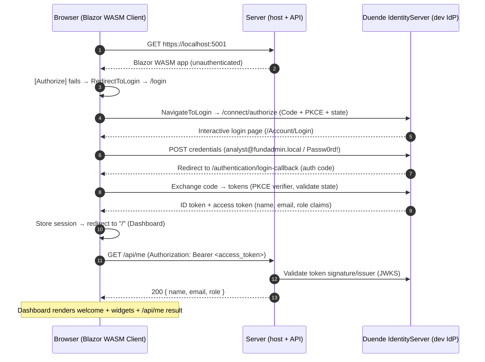

# FundAdmin Asset Management — Blazor WebAssembly (.NET 8) SSO

An asset-management system for mutual funds, built as a **hosted Blazor WebAssembly**
application with a complete **OIDC (OpenID Connect) Single Sign-On** flow.

The solution is **self-contained**: it ships with an in-memory **Duende IdentityServer**
dev Identity Provider, so you can run and test the full login → dashboard → logout
flow with a single command — **no external SSO provider required**.

---

## Prerequisites

- **.NET 8 SDK** (the projects target `net8.0`; a newer SDK such as .NET 9/10 also
  builds them as long as the .NET 8 runtime/targeting pack is available).
- A trusted local HTTPS development certificate:

  ```bash
  dotnet dev-certs https --trust
  ```

## Run

```bash
dotnet run --project Server
```

Then open: **https://localhost:5001**

> In Visual Studio: make sure **`Server`** is the startup project (right-click
> `Server` → **Set as Startup Project**), then press **F5**. The `Client` and
> `Shared` projects are class libraries and cannot be started directly.

### Test user

| Username                     | Password    | Role               |
| ---------------------------- | ----------- | ------------------ |
| `analyst@fundadmin.local`    | `Passw0rd!` | InvestmentManager  |

> The login form is pre-filled with these credentials for convenience.

---

## What you should see (end-to-end flow)

1. Open `https://localhost:5001` → not authenticated → redirected to the **Login** page.
2. Click **"Login dengan SSO"** → redirected to the dev IdP login page.
3. Sign in with the test user → redirected back to the app.
4. Land on the **Dashboard** showing the signed-in user's **name and role**
   (`Andi Analyst` / `InvestmentManager`) plus dummy widget cards.
5. The dashboard calls **`GET /api/me`** with the access token and shows
   `{ name, email, role }` — proving the token is valid against the API.
6. The sidebar shows placeholder pages: **Stock Position**, **Shares**,
   **Chart of Account** ("Coming soon").
7. Click **Logout** → local session + IdP session cleared → back to the Login page.

---

## Authentication flow (sequence)



---

## Architecture

```
Project-SSO/
├─ FundAdmin.slnx              # solution
├─ Client/                     # Blazor WebAssembly (runs in the browser)
│  ├─ Program.cs               # AddOidcAuthentication (Code + PKCE)
│  ├─ App.razor                # Router + AuthorizeRouteView + Cascading auth state
│  ├─ Pages/                   # Dashboard, Login, Authentication, placeholders, AccessDenied
│  ├─ Layout/                  # MainLayout (top bar + logout), NavMenu (sidebar)
│  ├─ Components/              # RedirectToLogin
│  └─ wwwroot/
│     ├─ index.html            # loads blazor.webassembly.js + AuthenticationService.js
│     └─ appsettings.json      # OIDC settings (Authority, ClientId, scopes, redirect URIs)
├─ Server/                     # ASP.NET Core host + API + dev Identity Provider
│  ├─ Program.cs               # Hosts WASM, JWT Bearer API auth, Duende IdentityServer
│  ├─ Config.cs                # In-memory clients / scopes / resources / test users
│  ├─ Controllers/MeController.cs   # GET /api/me  ([Authorize] Bearer)
│  ├─ Pages/Account/Login.*    # Interactive IdP login page
│  └─ Pages/Account/Logout.*   # IdP end-session (RP-initiated logout) handler
└─ Shared/                     # Shared DTOs
   └─ UserProfileDto.cs        # { Name, Email, Role }
```

### Authentication design

- **Client is a public client** — Authorization Code Flow **+ PKCE**, *no client secret*
  is ever stored in the browser. State + PKCE are handled by
  `Microsoft.AspNetCore.Components.WebAssembly.Authentication`.
- The **Server** plays three roles on the same origin (`https://localhost:5001`):
  1. Hosts the compiled Blazor WASM client (`UseBlazorFrameworkFiles`).
  2. Exposes the protected API (`/api/me`) validated with **JWT Bearer**.
  3. Acts as the **dev Identity Provider** (Duende IdentityServer) issuing tokens.
- IdentityServer keeps its **cookie scheme (`idsrv`) as the default** for the
  interactive browser login; the API opts into the separate **`Bearer`** scheme
  via `[Authorize(AuthenticationSchemes = "Bearer")]`.

### OIDC configuration (`Oidc` section, consistent across Client & Server)

| Setting       | Value                                                        |
| ------------- | ----------------------------------------------------------- |
| Authority     | `https://localhost:5001`                                    |
| ClientId      | `fundadmin-wasm`                                             |
| ResponseType  | `code` (PKCE)                                                |
| Scopes        | `openid`, `profile`, `email`, `fundadmin.api`               |
| RedirectUri   | `https://localhost:5001/authentication/login-callback`      |
| PostLogoutUri | `https://localhost:5001/authentication/logout-callback`     |

---

## Screenshots

> Drop your captured images into a `docs/` folder and they will render here.

| Screen | Preview |
| ------ | ------- |
| Login page (SSO button) | `docs/01-login.png` |
| Dev IdP sign-in | `docs/02-idp-login.png` |
| Dashboard (welcome + widgets + `/api/me`) | `docs/03-dashboard.png` |
| Placeholder page (Coming soon) | `docs/04-placeholder.png` |

<!--
To embed an image once captured, replace the path cell above with, e.g.:

-->

---

## Switching to a production Identity Provider (Azure AD / Keycloak)

Swapping providers requires **configuration changes only** — no application code:

1. In `Client/wwwroot/appsettings.json` and `Server/appsettings.json`, update the
   `Oidc` section (`Authority`, `ClientId`, redirect URIs, scopes).
2. In `Server/Program.cs`, delete the `AddIdentityServer(...)` block and the
   `app.UseIdentityServer()` call, and remove the `Server/Pages/Account/*` pages
   (those exist only for the in-memory dev IdP).
3. Register the same redirect URIs in your real provider.

Search for the `TODO:` comments in `Server/Program.cs` and `Client/Program.cs`.

---

## Troubleshooting

**"A project with an Output Type of Class Library cannot be started directly."**
You are trying to run `Client` or `Shared`. In a hosted Blazor WASM model only
**`Server`** is executable — set it as the startup project (Visual Studio) or run
`dotnet run --project Server`.

**`Could not find 'AuthenticationService.init' ('AuthenticationService' was undefined).`**
`wwwroot/index.html` is missing the auth library's JavaScript. It must include,
right after `blazor.webassembly.js`:

```html
<script src="_content/Microsoft.AspNetCore.Components.WebAssembly.Authentication/AuthenticationService.js"></script>
```

After fixing it, do a hard refresh (Ctrl+Shift+R) so the cached `index.html` is replaced.

**Browser shows a certificate / "connection is not private" warning on `https://localhost:5001`.**
Trust the local dev certificate once: `dotnet dev-certs https --trust` (then restart the browser).

**`ERR_CONNECTION_REFUSED` on a `.../browserLinkSignalR/...` URL in the console.**
Harmless — that is Visual Studio's Browser Link feature, not the application.

**A Duende license warning appears on startup.**
Expected and **allowed for development/testing**. A license is only required for
production use.

---

## Notes

- Roles used by the system: `InvestmentManager`, `FundAdministrator`,
  `RiskManager`, `ComplianceOfficer`.
- The UI text is in Indonesian; only the OIDC/business identifiers are in English.
- The business modules (Stock Position, Shares, Chart of Account) are navigation
  **placeholders** at this stage — no business logic yet.
</content>
</invoke>
