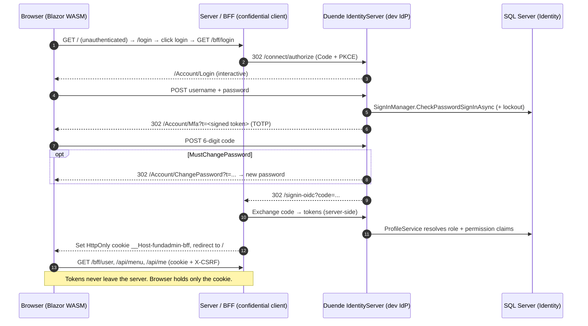

# FundAdmin SSO — Master Identity Platform (.NET 10) · Blazor WASM + BFF

A centralized **Single Sign-On / identity platform** for an OJK-supervised multifinance context, built as a **hosted Blazor WebAssembly** app secured with the **Backend-for-Frontend (BFF)** pattern. It provides persistent **user & password management**, permission-based **RBAC with server-driven menus**, and **activity (audit) monitoring** — backed by **ASP.NET Core Identity + SQL Server** and **Duende IdentityServer**.

> **Why BFF?** In a plain SPA the access/ID tokens live in the browser (readable by JavaScript, exposed in the Network tab, vulnerable to XSS token theft). With BFF the **server** performs the OIDC code exchange and **keeps the tokens server-side**. The browser only ever holds an **HttpOnly, Secure session cookie** — no token is ever exposed to JavaScript.

The solution is **self-contained**: it ships with a Duende IdentityServer dev IdP and an idempotent seeder, so the full **login → MFA → (forced password change) → dashboard** flow runs with a single command against your local SQL Server.

---

## 📑 Table of Contents

- [Quick Start](#quick-start)
- [Tech Stack](#tech-stack)
- [Highlights](#highlights)
- [Solution Structure](#solution-structure-layered)
- [Prerequisites](#prerequisites)
- [Run](#run)
- [End-to-End Flow](#end-to-end-flow)
- [Authorization Model](#authorization-model)
- [Activity Monitoring](#activity-monitoring)
- [Security Considerations](#security-considerations)
- [API Endpoints](#api-endpoints)
- [Troubleshooting](#troubleshooting)
- [Documentation](#documentation)
- [License](#license)

---

## ⚡ Quick Start

Get FundAdmin SSO running in 3 steps:

```bash
# 1. Ensure .NET 10 SDK and SQL Server are installed
dotnet --version

# 2. Update connection string (Server/appsettings.Development.json)
# Change "Server=DEVALDICALIESTA" to your SQL Server instance

# 3. Run the app
dotnet run --project Server
```

Open **https://localhost:5001** and login with:
- **Username:** `admin@fundadmin.local`
- **Password:** `Admin#FundAdmin2026!`

Follow the prompts for MFA setup and password change.

---

## 🛠️ Tech Stack

| Component | Technology |
|-----------|-----------|
| **Framework** | .NET 10 / ASP.NET Core 10 |
| **Frontend** | Blazor WebAssembly (WASM) |
| **Backend** | ASP.NET Core + BFF Pattern |
| **Identity** | ASP.NET Core Identity + Duende IdentityServer 7.x |
| **Database** | SQL Server (EF Core) |
| **Authentication** | OIDC + MFA (TOTP) |
| **Authorization** | RBAC (Role-Based Access Control) with dynamic policies |
| **Security** | HttpOnly/Secure cookies, CSRF protection, CSP headers |

---

## Highlights

- **.NET 10** across all projects (`net10.0`), ASP.NET Core / EF Core / Identity `10.0.9`.
- **Persistent identity** — ASP.NET Core Identity (GUID keys) over EF Core + SQL Server.
- **Password management** — policy (≥12 chars, complexity), **no-reuse history** (last 5), **adaptive lockout**, admin reset (one-time temp password), and **forced password change** on first login.
- **MFA (TOTP)** — per-user secret, **encrypted at rest** via the Data Protection API; QR enrollment; `amr = [pwd, mfa]`.
- **Permission-based RBAC** — users → roles → permissions, plus per-user grant/deny overrides (**deny wins**). API gated by `[Authorize(Policy = "perm:...")]`; the navigation menu is **server-resolved** (`GET /api/menu`) so the UI only shows what you may access.
- **Activity monitoring** — append-only `AuditEvents`; an EF `SaveChanges` interceptor audits `[Auditable]` entity changes in-transaction, plus explicit auth/authz/user-mgmt events.
- **Admin console** — Users (create / enable / disable / unlock / reset password / assign roles), Roles & Permissions, and an Activity Log viewer.
- **Hardening** — `__Host-` HttpOnly/Secure/SameSite cookie, CSRF header, security headers (CSP/HSTS/etc.), secrets out of source.

---

## Solution structure (layered)

```
Project-SSO/
├─ FundAdmin.slnx
├─ docs/                     # ARCHITECTURE-SSO-Master-v1.md, RUN.md, P0/P1 notes
├─ Client/                   # Blazor WebAssembly SPA (browser; no tokens)
│  ├─ Services/              # BffAuthenticationStateProvider, AntiforgeryHandler
│  ├─ Pages/                 # Dashboard, Login, Admin/Users, Admin/Roles, Admin/Audit, ...
│  └─ Layout/                # MainLayout, NavMenu (server-driven), EmptyLayout
├─ Server/                   # ASP.NET Core host: BFF + API + dev IdP + composition root
│  ├─ Program.cs             # Cookie+OIDC+BFF, IdentityServer, DI, migrate+seed, headers
│  ├─ Controllers/           # Me, Menu, Users, Roles, Permissions, Audit
│  ├─ Pages/Account/         # Login, Mfa, ChangePassword, Logout (interactive IdP UI)
│  └─ Services/              # TotpService, LoginStateProtector, ProfileService, ...
├─ Shared/                   # DTOs shared with the WASM client
├─ SSO.Domain/               # Entities + enums (persistence-ignorant)
│  ├─ Identity/  Rbac/  Auditing/  Enums/
├─ SSO.Application/          # Abstractions / use-case interfaces (no EF, no ASP.NET)
└─ SSO.Infrastructure/       # EF Core DbContext, configs, migrations, services, seeder
   └─ Persistence/  Rbac/  Auditing/  Security/  Seeding/
```

Dependency flow: `Domain ← Application ← Infrastructure ← Server`, and `Client → Shared`.
See **`docs/ARCHITECTURE-SSO-Master-v1.md`** for the full design and roadmap.

---

## Prerequisites

- **.NET 10 SDK** (projects target `net10.0`).
- **SQL Server** reachable locally. Default config points at instance **`DEVALDICALIESTA`** (= `localhost`) and database **`SSO-PROJECT`** with Windows Authentication. Adjust the connection string for your machine (see below).
- A trusted local HTTPS dev certificate:

  ```bash
  dotnet dev-certs https --trust
  ```

### Database connection

Set in `Server/appsettings.Development.json` → `ConnectionStrings:Sso`:

```json
"ConnectionStrings": {
  "Sso": "Server=DEVALDICALIESTA;Database=SSO-PROJECT;Trusted_Connection=True;TrustServerCertificate=True;MultipleActiveResultSets=true"
}
```

> Change `Server=` to your instance (e.g. `localhost`, `.\SQLEXPRESS`, `(localdb)\MSSQLLocalDB`).
> **Make sure SSMS is connected to the same instance** — otherwise the DB looks "missing" when it was actually created on a different server.

The schema is created automatically: on startup the app runs **`Database.MigrateAsync()`** (applies the `InitialIdentityRbacAudit` migration, creating the DB if needed) and then an **idempotent seeder** inserts the permission catalogue, base roles, the menu tree, and the break-glass admin.

---

## Run

```bash
dotnet run --project Server
```

Open **https://localhost:5001**.

> In Visual Studio set **`Server`** as the startup project and press **F5**.
> `Client`, `Shared`, `SSO.*` are libraries and cannot be started directly.

### Bootstrap admin (seeded)

| Username | Password | Role | First login |
| --- | --- | --- | --- |
| `admin@fundadmin.local` | `Admin#FundAdmin2026!` | Administrator | **must change** + MFA |

Configurable via the `Admin` section in `Server/appsettings.json` (`Admin:Email`, `Admin:Password`). The seeder creates this user with `MustChangePassword = true`.

**Seeded roles:** `Administrator` (all permissions) and `InvestmentManager` (read-only: dashboard, stock-position, shares, chart-of-account).

---

## End-to-end flow

1. Open `https://localhost:5001` → not authenticated → **Login** page.
2. Click **"Login dengan SSO"** → `/bff/login` → the dev IdP login page.
3. Enter the admin credentials → **MFA**: scan the QR with an authenticator app, enter the 6-digit code.
4. **Forced password change** (first login): set a new password (≥12, complexity, and **not** one of your recent passwords).
5. Land on the **Dashboard**; the left menu is rendered from `GET /api/menu` for your permissions. As Administrator you also see **Administration → Users / Roles & Permissions / Activity Log**.
6. **Logout** → cookie + IdP session cleared.

> **Verify the security win:** DevTools → Application/Network shows only the `__Host-fundadmin-bff` cookie (HttpOnly) — **no token anywhere**.

### Authentication flow (sequence)



---

## Authorization model

- **Permissions** are the atomic unit (`dashboard.view`, `master-data.shares.manage`, `admin.users.manage`, …). Roles bundle permissions; users get roles plus optional per-user **grant/deny** overrides (deny always wins).
- **API**: a dynamic `IAuthorizationPolicyProvider` turns `perm:<code>` into a policy, so controllers use `[Authorize(Policy = "perm:admin.users.manage")]` with no pre-registration.
- **Claims**: a custom `IProfileService` resolves the effective permission set and issues `role` + `permission` claims into the tokens (kept server-side by the BFF).
- **Menu**: `GET /api/menu` returns only the nodes whose required permission the caller holds; the Blazor `NavMenu` renders that tree (no hardcoded links).

---

## Activity monitoring

Every sensitive action is written to `AuditEvents` (who / what / when / outcome / correlation id / IP / user-agent):

- **Authentication** — login success/failure, MFA success/failure, password change, logout.
- **User management** — create / enable / disable / unlock / reset / role change / permission change.
- **Data changes** — an EF Core `SaveChanges` interceptor records create/update/delete of `[Auditable]` entities (secrets/hashes redacted).

> Tamper-evident **SQL Server Ledger** for `AuditEvents` is a documented next-step hardening (see `docs/`); today it is a standard append-only table.

### Authentication schemes

| Scheme | Purpose |
| --- | --- |
| `cookie` | BFF session cookie (`__Host-fundadmin-bff`, HttpOnly/Secure/SameSite=Strict). App default. |
| `oidc` | Challenges the IdP (server-side Code + PKCE). |
| `idsrv` | IdentityServer's own interactive-login session. |

In **Development** IdentityServer uses a **developer signing credential** (`tempkey.jwk`, git-ignored) instead of automatic key management — avoids "key not found in key ring" after key/Data-Protection resets. Production should use managed/HSM-backed keys (see `docs/`).

---

## 🔒 Security Considerations

This solution implements several security hardening measures:

### Cookie Security
- **HttpOnly flag** — prevents JavaScript access (mitigates XSS token theft)
- **Secure flag** — HTTPS-only transmission
- **SameSite=Strict** — prevents CSRF attacks
- **Prefix `__Host-`** — restricts to secure scope per RFC 6265bis

### Password Security
- **Minimum 12 characters** with complexity requirements (uppercase, lowercase, digit, symbol)
- **No-reuse history** — last 5 passwords tracked
- **Adaptive lockout** — escalating delays after failed attempts
- **Forced password change** — on first login and after admin reset

### Data Protection
- **MFA secrets encrypted at rest** — via DPAPI
- **Audit logs append-only** — SQL Server Ledger (future enhancement)
- **Secrets externalized** — no sensitive data in source code

### Network Security
- **CSRF tokens** — per-request header validation
- **Content Security Policy (CSP)** — strict inline script blocking
- **HSTS headers** — enforce HTTPS
- **X-Frame-Options** — clickjacking prevention

### Authorization
- **Dynamic policy provider** — no hardcoded permission checks
- **Deny-wins model** — explicit deny overrides role permissions
- **Server-driven menus** — UI reflects actual permissions (no spoofing)

---

## 📡 API Endpoints

| Endpoint | Method | Purpose | Auth |
| --- | --- | --- | --- |
| `/bff/login` | GET | Initiate OIDC login flow | — |
| `/bff/logout` | GET | Clear session and IdP tokens | ✓ |
| `/api/me` | GET | Current user profile | ✓ |
| `/api/menu` | GET | Server-driven navigation menu | ✓ |
| `/api/users` | GET/POST | List/create users | `perm:admin.users.manage` |
| `/api/users/{id}` | GET/PUT/DELETE | User detail / update / delete | `perm:admin.users.manage` |
| `/api/roles` | GET/POST | List/create roles | `perm:admin.roles.manage` |
| `/api/permissions` | GET | List all permissions | `perm:admin.roles.manage` |
| `/api/audit` | GET | Activity log | `perm:admin.audit.view` |

> See controller files in `Server/Controllers/` for full details.

---

## Troubleshooting

**The database looks like it wasn't created.** It almost certainly was — on a *different* SQL instance. Ensure `ConnectionStrings:Sso` and the instance open in SSMS are the **same** server.

**Login stays on the sign-in page.** Server-side login is fine if the credentials are current. Common causes: (a) the password was already changed away from the seed value (check the small red error "Invalid username or password"); (b) stale browser cookies — use a fresh InPrivate window. The Login → MFA handoff uses a **signed, time-limited token** (not a TempData cookie), so it survives redirects.

**`error: Conflicting assets ... appsettings#[.{fingerprint}]`.** A stale static-web-assets cache from the .NET 10 SDK. Delete `bin`/`obj` and rebuild.

**Browser cert warning on `https://localhost:5001`.** `dotnet dev-certs https --trust`, then restart the browser.

**`browserLinkSignalR` / `aspnetcore-browser-refresh` CSP noise in the console.** Harmless dev tooling; the CSP is widened for these in Development only.

**A Duende license warning on startup.** Expected and allowed for development/testing.

---

## Documentation

- **`docs/ARCHITECTURE-SSO-Master-v1.md`** — Target architecture, RBAC & audit design, security hardening checklist, phased roadmap (mapped to OJK / UU PDP).
- **`docs/RUN.md`** — Detailed run & first-login guide.
- **`docs/P0-foundation-and-next-steps.md`** — Data layer foundation & migration notes.

> Most UI text is in Indonesian; identifiers and code are in English. Business modules (Stock Position, Shares, Chart of Account) are navigation placeholders pending domain logic.

---

## 📜 License

This project is proprietary and confidential. All rights reserved.

For licensing inquiries, contact the project owner.

---

**Last Updated:** June 2026  
**Built with:** .NET 10 · Blazor WASM · ASP.NET Core · Duende IdentityServer
